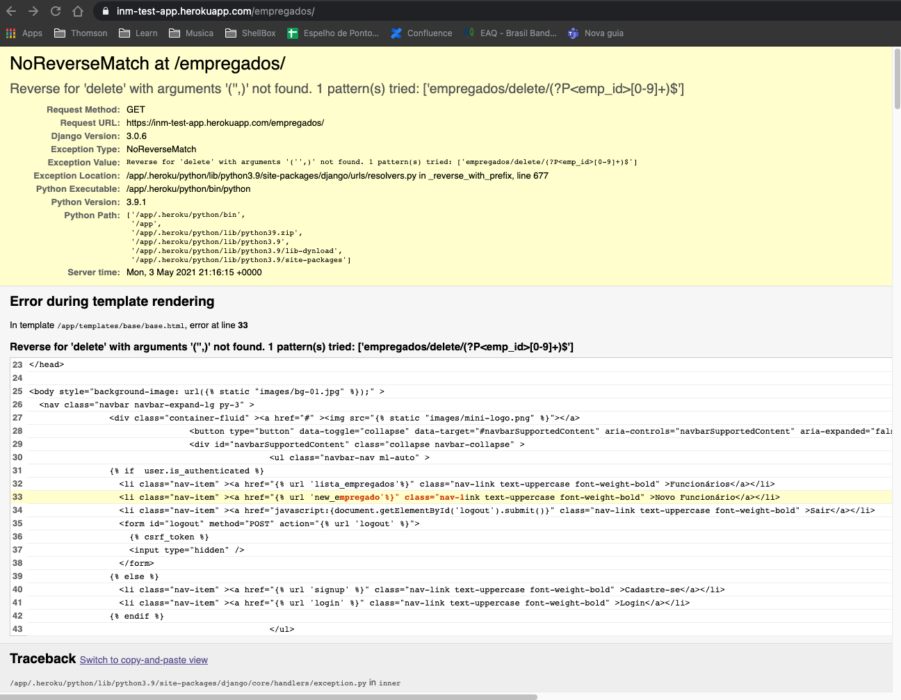

# Processo seletivo: InMetrics
Como parte do processo seletivo, está o desenvolvimento
da automação voltado para a plataforma WEB.
## Instalação
Para que seja possível executar o projeto, antes de mais nada
por favor execute
```` shell
gem install bundle
````
e depois
```` shell
bundle install
````
## Executando
Para executar o projeto em máquina local:
```` shell
bundle exec cucumber
````
Para caso queira um report allure de forma local:
```` shell
bundle exec cucumber --profle allure
````
Para caso queria executar em uma máquina docker
```` shell
docker-compose run ruby cucumber --profile allure
````
## Report
Aqui estou usando o allure report como ferramenta. Por 
padrão os reports ficarão na pasta report. Depois de terminado, caso
queira visualizar, usar a ferramenta o allure para demonstrar. Mais
informações no link [para instalação do allure](https://docs.qameta.io/allure/)
### Erros
Devido ao erro abaixo, não foi possível realizar os testes
relacionados ao cadastro de funcionário. Assim o cenário de login com sucesso
terá falha

Na página de cadastro, os campos de senha apresenta a palavra
obrigatório de forma ERRADA. Por isso, temos dois cenários com erro!!